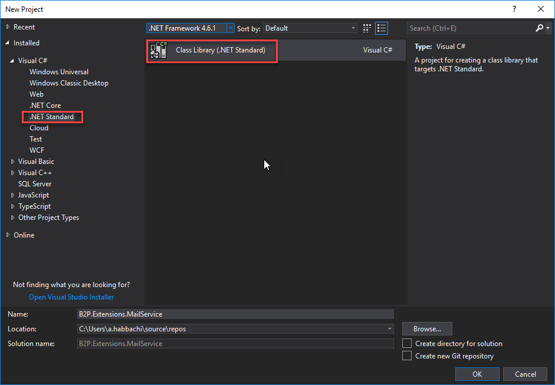
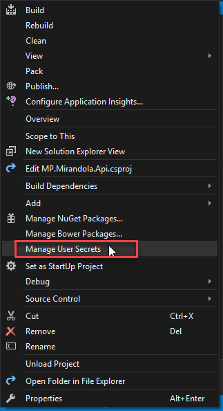

## Why .Net Standard 2.0

I am aware that it is not a good practice to redirect the reader to another article right from the first lines of your post, but I loved the first couple of lines that [Microsoft written](https://docs.microsoft.com/en-us/dotnet/standard/net-standard) to explain the **.Net Standard**.
<!-- more -->
So to encapsulate that **.Net Standard 2.0** is your friend to target when you are writing BCLs (Base Class Libraries) as Microsoft added a [bunch of old API](https://github.com/dotnet/standard/blob/master/docs/versions/netstandard2.0.md) to this new .Net base framework that any other .Net framework support and understand. And that is why I have decided to port most of my library to this framework.

## SMTP Email Sender Service

I choose to use SMTP approach over any other stuff as I may be willing to change the host or domain server in future, so using smtp allow me to easily switch platforms. Starting by creating a new .Net standard Class library project;  

  

And then let’s prepare a class object, and we call it `AuthMessageSenderOptions`, that holds all the information that we are going to use in our `EmaiService`.  

```csharp
    public class AuthMessageSenderOptions
    {
        public string Domain { get; set; }
        public int Port { get; set; }
        public string UserName { get; set; }
        public string Key { get; set; }
        public bool UseSsl { get; set; }
        public bool RequiresAuthentication { get; set; } = true;
        public string DefaultSenderEmail { get; set; }
        public string DefaultSenderDisplayName { get; set; }
        public bool UseHtml { get; set; }
    }
```  

feel free to add stuff that you think we can use it later, just keep in mind that this is the sender stuff in some project I created another class for the receiver options but naah lets keep it simple for now ok!
Thought we should follow the rules and create an interface for our mail service that holds the contract to allow us to use the ``SendEmail`` methods;  

```csharp
    public interface IEmailSender
    {
        Task SendEmailAsync(string email, string subject, string message);
        void SendEmail(string email, string subject, string message);
    }
```  

Create a new class, and name it `EmailSender`, then add our `AuthMessageSenderOptions` object in the constructor, and do not forget these using those are all what we need:  

```csharp
using System;
using System.Net;
using System.Net.Mail;
using System.Threading.Tasks;

namespace B2P.Extensions.MailService
{
    public class EmailSender
    {
        public AuthMessageSenderOptions Options { get; }

        public EmailSender(AuthMessageSenderOptions senderOptions)
        {
            Options = senderOptions;
        }
    }
}
```  

And we make the class inherits the `IEmailSender` interface and generate the two SendEmail actions and add them to our `EmailSender`, these are the three properties that I found necessary;  


```csharp
    public class EmailSender : IEmailSender
    {
        . . .
        . . .
        public Task SendEmailAsync(string toEmail, string subject, string message)
        {
            MailMessage mail = GetMailMessage(toEmail, subject, message,
                Options.DefaultSenderEmail, Options.DefaultSenderDisplayName, Options.UseHtml);
            SmtpClient client = GetSmtpClient(Options.Domain, Options.Port, Options.RequiresAuthentication,
                Options.UserName, Options.Key, Options.UseSsl);

            return client.SendMailAsync(mail);
        }

        public void SendEmail(string toEmail, string subject, string message)
        {
            MailMessage mail = GetMailMessage(toEmail, subject, message,
                Options.DefaultSenderEmail, Options.DefaultSenderDisplayName, Options.UseHtml);
            SmtpClient client = GetSmtpClient(Options.Domain, Options.Port, Options.RequiresAuthentication,
                Options.UserName, Options.Key, Options.UseSsl);

            client.Send(mail);
        }
    }
```  

Now we should be preparing the `GetMailMessage` and  `GetSmtpClient` methods that will do the main initilization for us;  

```csharp
    public class EmailSender
    {
        . . .
        . . .
        private static MailMessage GetMailMessage(string toEmail, string subject, string message,
            string defaultSenderEmail, string defaultSenderDisplayName = null, bool useHtml = true)
        {
            MailAddress sender;

            if (string.IsNullOrEmpty(defaultSenderEmail))
            {
                throw new ArgumentException("No sender mail address was provided");
            }
            else
            {
                sender = !string.IsNullOrEmpty(defaultSenderDisplayName) ?
                    new MailAddress(defaultSenderEmail, defaultSenderDisplayName) : new MailAddress(defaultSenderEmail);
            }

            MailMessage mail = new MailMessage()
            {
                From = sender,
                Subject = subject,
                Body = message,
                IsBodyHtml = useHtml
            };
            mail.To.Add(toEmail);
            return mail;
        }

        private static SmtpClient GetSmtpClient(string host, int port, bool requiresAuthentication = true,
            string userName = null, string userKey = null, bool useSsl = false)
        {
            SmtpClient client = new SmtpClient();

            if (string.IsNullOrEmpty(host))
            {
                throw new ArgumentException("No domain was provided");
            }

            client.Host = host;

            if (port > -1)
            {
                client.Port = port;
            }

            client.UseDefaultCredentials = !requiresAuthentication;

            if (requiresAuthentication)
            {
                if (string.IsNullOrEmpty(userName))
                {
                    throw new ArgumentException("No user name was provided");
                }

                client.Credentials = new NetworkCredential(userName, userKey);
            }

            client.EnableSsl = useSsl;
            client.DeliveryMethod = SmtpDeliveryMethod.Network;
            return client;
        }
    }
```  

And that’s it now it should be working.
What I love to do for my ASP.net core projects is to use my secrets I mean (the user secrets);
Go ahead and change the constructor of the `EmailSender` as following:  

```csharp
public class EmailSender : IEmailSender
    {
        public AuthMessageSenderOptions Options { get; }

        public EmailSender(IOptions<AuthMessageSenderOptions> optionsAccessor)
        {
            Options = optionsAccessor.Value;
        }
    }
```  

Like that I can use my secrets and manage the properties from a JSON file, right click on your solution and choose  **Manage User Secrets** a JSON file is going to be opened  

  

```json
{
  "AuthMessageSenderOptions": {
    "Domain": "smtp.sendgrid.net",
    "Port": 587,
    "UserName": "apikey",
    "Key": "yourApikey",
    "UseSsl": false, //25, 587 (for unencrypted/TLS connections) for ssl use port 465
    "DefaultSenderEmail": "support@b2p.com",
    "DefaultSenderDisplayName": "Support"
  }
}
```  

The one and only thing that we should take care about now is to register our sender option configuration and use our `EmailSender` service as a Singleton:  

```csharp
        public void ConfigureServices(IServiceCollection services)
        {
            . . .
            . . .
            services.Configure<AuthMessageSenderOptions>(Configuration.GetSection("AuthMessageSenderOptions"));
            services.AddSingleton<IEmailSender, EmailSender>();
        }
```  

like that as soon and our `EmailSender` gets initialize it’s going to look forward to get the sender options from configuration in our case from the user secrets, in other post I will include how to get options or configuration from database.

I hope that this is helpful for you can find all the code in [Github](https://github.com/Capoutcha/MailService).
